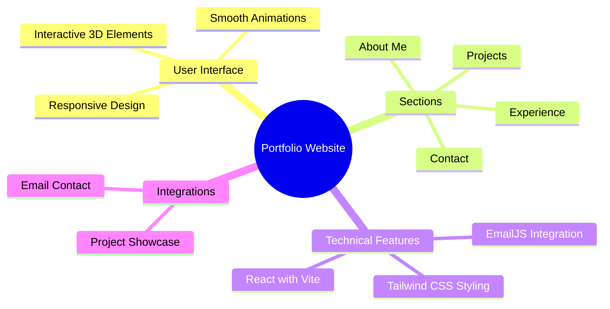

  <a href="#features">Features</a> •
  <a href="#demo">Demo</a> •
  <a href="#screenshots">Screenshots</a> •
  <a href="#installation">Installation</a> •
  <a href="#tech-stack">Tech Stack</a>

A modern, responsive portfolio website showcasing professional experience, projects, and skills. Built with React, Vite, and Tailwind CSS, featuring smooth animations and interactive 3D elements. ✨

## ✨ Features

